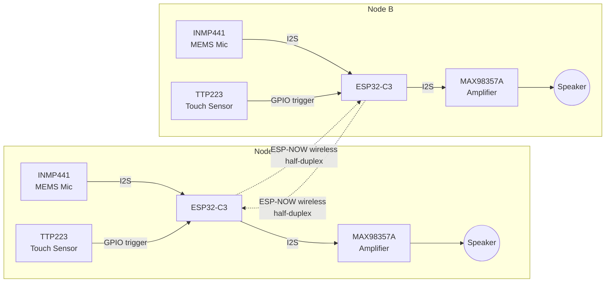

# Vocal-HUD: Smart Wearable Audio-Visual Communication System

A compact, low-latency wireless voice-communication wearable built around two ESP32-C3 nodes. Each node captures voice through a digital MEMS microphone, streams it wirelessly to the paired node over ESP-NOW, and plays it back through a digital amplifier — with touch-based activation instead of mechanical switches. Designed as a scalable foundation for a future combined audio-visual heads-up display (HUD) platform.

> **Project status:** This repository documents a completed academic project (BMS College of Engineering, Project Work 1, 2025–26). The original firmware source is currently being reconstructed from the project's technical report and design notes — see [Code Status](#code-status) below.

## Table of Contents
- [Overview](#overview)
- [System Architecture](#system-architecture)
- [Hardware](#hardware)
- [Communication Design](#communication-design)
- [Results](#results)
- [Comparison with Commercial Wearables](#comparison-with-commercial-wearables)
- [Repository Structure](#repository-structure)
- [Code Status](#code-status)
- [Future Work](#future-work)
- [Team & Acknowledgments](#team--acknowledgments)
- [License](#license)

## Overview

Wearable communication devices need to move voice data with minimal delay while running on small, low-power embedded hardware — a combination that's hard to get right. Analog audio paths are fast but noisy; fully digital paths are cleaner but need tight clock synchronization across every peripheral in the chain, or you get dropouts and drift.

Vocal-HUD addresses this with a symmetric two-node design: each node is both a transmitter and a receiver, built around an ESP32-C3, an I2S MEMS microphone, an I2S digital amplifier, and a capacitive touch sensor for push-to-talk style control. The two nodes talk to each other directly over ESP-NOW, so there's no router, no pairing dance, and no internet dependency — just a direct, low-latency embedded link.

## System Architecture



**Signal path (one direction):**
1. User touches the TTP223 sensor → ESP32-C3 begins audio capture.
2. INMP441 digitizes voice and streams it over I2S (shared BCLK/LRCLK/data lines).
3. ESP32-C3 packages the digital audio and sends it via ESP-NOW to the paired node.
4. The receiving ESP32-C3 forwards the audio stream over I2S to its MAX98357A amplifier.
5. The amplifier drives the speaker, reproducing the voice in real time.

Communication is **half-duplex** — one node transmits at a time — which keeps the protocol simple and avoids acoustic feedback between the two speakers.

## Hardware

| Component | Role |
|---|---|
| XIAO ESP32-C3 | Microcontroller — audio processing, ESP-NOW wireless, I2S peripheral control |
| INMP441 | I2S MEMS microphone — digital voice capture |
| MAX98357A | I2S Class-D audio amplifier — digital-to-speaker output |
| TTP223 | Capacitive touch sensor — communication trigger, no mechanical switch |
| Speaker | Audio output transducer |
| 10 kΩ pull-down resistor | Stabilizes the TTP223 output line against floating-input noise |

Each of the two wearable nodes carries an identical set of these components — see [`docs/hardware-schematic.md`](docs/hardware-schematic.md) for the full wiring reference.

## Communication Design

**I2S synchronization.** The microphone and amplifier share the ESP32-C3's I2S clock lines (BCLK — bit clock, and LRCLK — word/channel select) so both peripherals stay in lockstep with the same audio clock domain. This avoids the sample-rate drift that shows up when digital audio peripherals run off independent clocks.

**Wireless link.** ESP-NOW was chosen over Bluetooth/Wi-Fi for the inter-node link because it's connectionless, low-overhead, and doesn't need an access point or pairing handshake — a good fit for a two-device wearable pair that always talks to the same peer.

**Touch control.** The TTP223 replaces a mechanical push-to-talk switch. A pull-down resistor on its output line prevents the floating-input glitches that capacitive sensors are prone to when unterminated.

**Latency tuning.** The single biggest lever on end-to-end delay turned out to be DMA buffer size on the I2S peripheral — smaller buffers cut latency substantially at the cost of more frequent (but individually smaller) transfers. See [Results](#results).

## Results

| Metric | Value |
|---|---|
| Latency, initial implementation | 80–250 ms |
| Latency, after DMA buffer optimization | 35–70 ms |
| Wireless hop latency | < 10 ms |
| Mic SNR | 61 dBFS |
| Amplifier output | 3.2 W (Class-D) |
| TRL (Technology Readiness Level) | 4 — component/system validated in lab environment |

The largest latency reduction came from shrinking the I2S DMA buffer and tuning the ESP-NOW payload size — trading a larger number of smaller wireless packets for a much shorter round trip per packet.

## Comparison with Commercial Wearables

| Feature | Vocal-HUD | Meta Ray-Ban | XREAL Air 2 | Bose Frames |
|---|---|---|---|---|
| Approx. cost | ₹5K–₹10K (BOM) | ₹30K–₹40K | ₹35K–₹50K | ₹20K–₹30K |
| Power consumption | Low | Moderate | High | Moderate |
| Main purpose | Real-time communication | AI smart glasses | AR entertainment | Audio wearable |
| Wireless link | ESP-NOW | Bluetooth/Wi-Fi | Bluetooth | Bluetooth |
| Internet dependency | No | Yes (many features) | Partial | Partial |
| Hardware complexity | Simple | Complex | Complex | Moderate |

*(Cost figures are indicative BOM-level estimates for the prototype, not a claim of retail pricing parity with the commercial products above.)*

## Repository Structure

```
vocal-hud/
├── README.md                        ← you are here
├── docs/
│   ├── hardware-schematic.md        ← pin mapping and wiring reference
│   └── project-report.pdf           ← full academic project report (optional to include)
├── firmware/
│   └── vocal_hud_node/
│       └── vocal_hud_node.ino        ← reference firmware (see Code Status)
└── LICENSE
```

## Code Status

The original firmware developed for the submitted project is not currently available in this repository. What's included under `firmware/` is a **reference reconstruction**, written from the documented architecture, pin mapping, and design decisions above, to demonstrate the communication and control logic described in the project report. It has not been re-validated on hardware and should be treated as a design reference rather than the exact submitted implementation.

## Future Work

- Integration of a compact HUD/visual display module alongside the audio path
- Full-duplex communication (simultaneous two-way audio)
- Battery life and power-consumption profiling
- Field testing outside the lab environment (current TRL is 4)

## Team & Acknowledgments

This was a team project completed as **Project Work 1** in the Department of Electronics & Communication Engineering, BMS College of Engineering (2025–26), under the guidance of **Dr. Maligi Anantha Sunil**, Assistant Professor, Dept. of ECE.

**Team:** Varun Reddy S V · Veeraboyeni Venkata Aditya Yadav · Vikas S · Vivek V Mara

## License

MIT — see [LICENSE](LICENSE).
